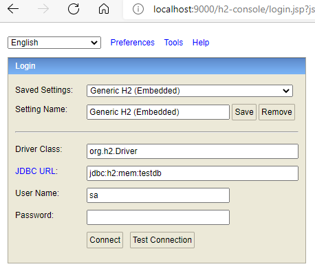
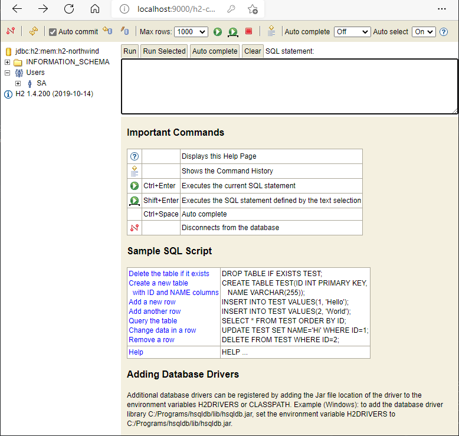

# Northwind Spring GraphQL Data Service

本项目实现了一个数据访问服务，能让客户端通过 GraphQL 来灵活的查询数据库数据。

本文分步骤描述了如何使用 [Spring Data JPA](https://spring.io/projects/spring-data-jpa) 以及 [Spring GraphQL](https://spring.io/projects/spring-graphql) 实现数据服务的过程。

## 开发环境

* Java 平台

  [Java 11 OpenJDK](https://adoptium.net/)

  配置镜像为 [阿里云 Maven 镜像](https://developer.aliyun.com/mirror/maven)。

* IDE

  [Visual Studio Code](https://code.visualstudio.com/)

  启用 VSCode 插件：

  * "Extension Pack for Java"，id 为 `vscjava.vscode-java-pack`
  * "Gradle for Java"，id 为 `vscjava.vscode-gradle`
  * "GraphQL", id 为 `graphql.vscode-graphql`

* 其他工具

  * "Git for Windows"，除了 Git 本身，还大量使用了其中的 'Git Bash'。
  * "Spring Boot CLI"，通过 'SDKMAN' 在 'Git Bash' 中安装。

更详细的开发环境配置请参考 [这里](...)

> 注意：
> 本文的命令行均采用 `bash` shell。
> Windows 中可以利用 "Git for Windows" 的 "Git Bash" 运行，或者利用 WSL 环境做开发。
> Linux 中可以直接在控制台运行。

## 实现基本的 Spring Boot JPA 数据服务

### 创建基本的项目代码

通过 `Spring Boot CLI` 创建基本的项目代码。

```shell
spring init \
  --build gradle \
  -l java \
  -b 2.5.6 \
  -g ly.northwind-example \
  -a northwind-spring-graphql-dataservice \
  -n DataServiceApplication \
  --description 'A project created by Spring Boot CLI.' \
  --package-name northwind.springgraphql.dataservice \
  -p jar \
  -j 11 \
  -d h2,data-jpa,web,lombok \
  northwind-spring-graphql/data-service
```

调整 Spring Web 应用程序配置文件为 YAML 格式。

```shell
# $ pwd
# */northwind-spring-graphql/data-service
cd ./src/main/resources
mv application.properties application.yaml
```

> 注意：
> 后续命令都基于 'northwind-spring-graphql/data-service' 目录。

调整 build.gradle 构建文件，改用 Lombok 官方推荐的插件形式：[The Lombok Gradle Plugin](https://projectlombok.org/setup/gradle)

添加如下配置代码

```gradle
plugins {
  id "io.freefair.lombok" version "6.2.0"
}
```

删除如下配置代码

```diff
- configurations {
-     compileOnly {
-         extendsFrom annotationProcessor
-     }
- }

dependencies {
-   compileOnly 'org.projectlombok:lombok'
-   annotationProcessor 'org.projectlombok:lombok'
}
```

测试是否能正常构建或运行现有程序。

```shell
./gradlew build
./gradlew bootRun
```

### 配置 H2 数据库

在 `application.yaml` 中配置 H2 数据库设置，启用 H2 Console。H2 数据库更详细的信息请参见 [官网](https://h2database.com/)。

```yaml
server：
  port: 9000
spring:
  h2:
    console:
      enabled: true
      path: /h2-console
      setting:
        web-allow-others: false
```

此时，运行程序：

```shell
./gradlew bootRun
```

使用浏览器访问：http://localhost:9000/h2-console/ 应该可以看到 H2 Console 控制台页面。



我们再添加一些设置，Spring Data JPA 会利用这些设置自动创建名为 `h2-northwind` 的空数据库。

注意这里使用了 H2 的 `内存数据库` 模式，主要是为了示例应用运行比较方便。

```yaml
spring:
  datasource:
    driverClassName: org.h2.Driver
    url: jdbc:h2:mem:h2-northwind
    username: sa
    password: mypass
  jpa:
    database-platform: org.hibernate.dialect.H2Dialect
```

此时访问 http://localhost:9000/h2-console/ 就可以正常登入 `h2-northwind` 数据库了。


