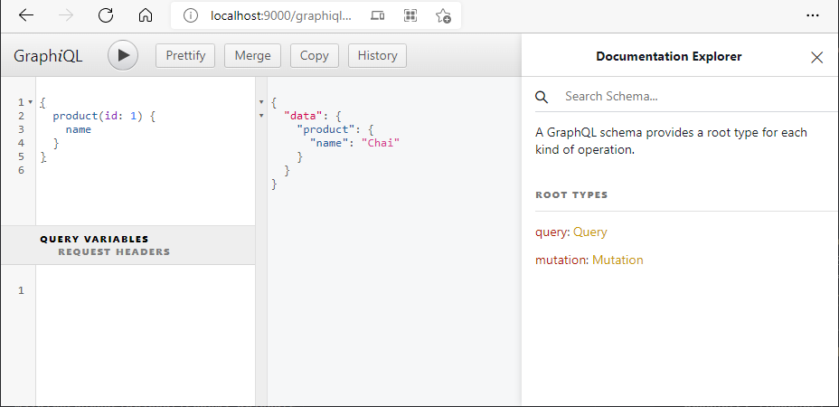

# Northwind Spring GraphQL Data Service

本项目实现了一个数据访问服务，能让客户端通过 GraphQL 来灵活的查询数据库数据。

本文分步骤描述了如何使用 [Spring Data JPA](https://spring.io/projects/spring-data-jpa) 以及 [Spring GraphQL](https://spring.io/projects/spring-graphql) 实现数据服务的过程。

## 开发环境

* Java 平台

  [Java 11 OpenJDK](https://adoptium.net/)

  配置镜像为 [阿里云 Maven 镜像](https://developer.aliyun.com/mirror/maven)。

* IDE

  [Visual Studio Code](https://code.visualstudio.com/)

  启用 VSCode 插件：

  * "Extension Pack for Java"，id 为 `vscjava.vscode-java-pack`
  * "Gradle for Java"，id 为 `vscjava.vscode-gradle`
  * "GraphQL", id 为 `graphql.vscode-graphql`

* 其他工具

  * "Git for Windows"，除了 Git 本身，还大量使用了其中的 'Git Bash'。
  * "Spring Boot CLI"，通过 'SDKMAN' 在 'Git Bash' 中安装。

更详细的开发环境配置请参考 [这里](...)

> 注意：
> 本文的命令行均采用 `bash` shell。
> Windows 中可以利用 "Git for Windows" 的 "Git Bash" 运行，或者利用 WSL 环境做开发。
> Linux 中可以直接在控制台运行。

## 实现基本的 Spring Boot JPA 数据服务

### 创建基本的项目代码

通过 `Spring Boot CLI` 创建基本的项目代码。

```shell
spring init \
  --build gradle \
  -l java \
  -b 2.5.6 \
  -g ly.northwind-example \
  -a northwind-spring-graphql-dataservice \
  -n DataServiceApplication \
  --description 'A project created by Spring Boot CLI.' \
  --package-name northwind.springgraphql.dataservice \
  -p jar \
  -j 11 \
  -d h2,data-jpa,web,lombok \
  northwind-spring-graphql/data-service
```

注意我们引入了这些依赖：

* H2 Database
* Spring Data JPA
* Lombok
* Spring Web

然后调整 Spring Web 应用程序配置文件为 YAML 格式。

```shell
# $ pwd
# */northwind-spring-graphql/data-service
cd ./src/main/resources
mv application.properties application.yaml
```

> 注意：
> 后续命令都基于 'northwind-spring-graphql/data-service' 目录。

调整 build.gradle 构建文件，改用 Lombok 官方推荐的插件形式：[The Lombok Gradle Plugin](https://projectlombok.org/setup/gradle)

添加如下配置代码

```gradle
plugins {
  id "io.freefair.lombok" version "6.2.0"
}
```

删除如下配置代码

```diff
- configurations {
-     compileOnly {
-         extendsFrom annotationProcessor
-     }
- }

dependencies {
-   compileOnly 'org.projectlombok:lombok'
-   annotationProcessor 'org.projectlombok:lombok'
}
```

测试是否能正常构建或运行现有程序。

```shell
./gradlew build
./gradlew bootRun
```

### 配置 H2 数据库

在 `application.yaml` 中配置 H2 数据库设置，启用 H2 Console。H2 数据库更详细的信息请参见 [官网](https://h2database.com/)。

```yaml
server：
  port: 9000
spring:
  h2:
    console:
      enabled: true
      path: /h2-console
      setting:
        web-allow-others: false
```

此时，运行程序：

```shell
./gradlew bootRun
```

使用浏览器访问：http://localhost:9000/h2-console/ 应该可以看到 H2 Console 控制台页面。


再添加一些设置，Spring Data JPA 会利用这些设置自动创建名为 `h2-northwind` 的空数据库。

```yaml
spring:
  datasource:
    driverClassName: org.h2.Driver
    url: jdbc:h2:mem:h2-northwind;DB_CLOSE_DELAY=-1;DB_CLOSE_ON_EXIT=FALSE
    username: sa
    password: mypass
  jpa:
    database-platform: org.hibernate.dialect.H2Dialect
```

注意这里使用了 H2 的 `内存数据库` 模式，主要是为了本示例应用调试更方便。生产环境中一般会使用数据文件如 `jdbc:h2:file:/data/testdb`。

此时访问 http://localhost:9000/h2-console/ 就可以正常登入 `h2-northwind` 数据库了。


注意 `spring.datasource.url` 取值中有两个特别的配置：

* `DB_CLOSE_DELAY=-1` 参考 http://www.h2database.com/html/features.html#in_memory_databases
* `DB_CLOSE_ON_EXIT=FALSE` 参考 https://docs.spring.io/spring-boot/docs/current/reference/html/features.html#features.sql.datasource.embedded

### 创建 Entity 和 Repository

接下来采用 `Code First` 的方式来为 Spring Data JPA 应用添加数据库访问能力。

假已经预先设计好了 Northwind 应用的领域对象及相应的数据库数据架构：


> 感谢 [pthom](https://github.com/pthom) 和他的 [项目](https://github.com/pthom/northwind_psql)。

根据上述架构先添加 category, product, supplier 这三个 Entity 以及对应的 Repository。

下面是关键代码片段，完整代码请参考代码库源代码。

```java
// Supplier.java

@Entity
@Data
public class Supplier {

    @Id
    @GeneratedValue(strategy = GenerationType.IDENTITY)
    @Column(nullable = false)
    private Long id;

    @Column(length = 40, nullable = false)
    private String companyName;

    @Column(length = 30)
    private String contactName;

    //...
}
```

```java
// Category.java

@Entity
@Data
public class Category {

    @Id
    @GeneratedValue(strategy = GenerationType.IDENTITY)
    @Column(nullable = false)
    private Long id;

    @Column(length = 15, nullable = false)
    private String name;

    private Clob description;

    private Blob picture;
}
```

```java
// Product.java

@Entity
@Data
public class Product {

    @Id
    @GeneratedValue(strategy = GenerationType.IDENTITY)
    @Column(nullable = false)
    private Long id;

    @Column(length = 40)
    private String name;

    @Column(name = "supplier_id")
    private Long supplierId;

    @ManyToOne(fetch = FetchType.LAZY)
    @JoinColumn(name = "supplier_id", insertable = false, updatable = false)
    @JsonIgnore
    private Supplier supplier;

    @Column(name = "category_id")
    private Long categoryId;

    @ManyToOne(fetch = FetchType.LAZY)
    @JoinColumn(name = "category_id", insertable = false, updatable = false)
    @JsonIgnore
    private Category category;

    @Column(length = 20)
    private String quantityPerUnit;

    private BigDecimal unitPrice;

    private Integer unitsInStock;

    private Integer unitsOnOrder;

    private Integer reorderLevel;

    @Column(nullable = false)
    private Integer discontinued;
}
```

代码中可以看到这几点：

* 使用了 Lombok `@Data` 注解来辅助补充实现 Entity 类。如果觉得编译时 "嵌入" Lombok 自动生成的代码对开发/调试不直观，可以使用 "The Lombok Gradle Plugin" 的 `delombok` 构建任务来生成完整代码。
* 主键字段采用 `Long` 而非 `long` 或者 `Integer`。
  * 虽然 `long` 占用空间更小，但直接使用 `Long` 减少了访问 Entity 对象传参时的 `boxing/unboxing` 操作。
  * 上述 Entity 采用了自增长主键注解 `@GeneratedValue(strategy = GenerationType.IDENTITY)`，因此 `Long` 更符合常规数据库自增长主键的物理数据类型 `BIGINT`。
  * 更多主键自动生成或自定义策略可以参考 [这里](https://blog.csdn.net/u011781521/article/details/72210980) 和 [这里](https://blog.csdn.net/coding1994/article/details/79597057)
* 采用 `java.sql.Clob` 类型来映射较长的文本 `Category.description`。
* 采用 `java.sql.Blob` 类型来映射二进制数据内容如图片 `Category.picture`。
* 采用 `java.math.BigDecimal` 类型来映射货币值，因为 `Float` 和 `Double` 类型都有四舍五入引起的精度问题。
* 利用 `@Column` 注解定义了字段的常规约束。

实体类 `Product` 与 `Supplier`、`Category` 分别具有多对一关系，并且本程序只需要 `Product` 为起始的单向关系，所以只在 `Product` 中定义了 `@ManyToOne` 的映射注解，而并没有在 `Supplier` `Category` 中定义 `@OneToMany` 的字段映射注解。更多的实体关系注解的示例可以参考 [这里](https://www.w3cschool.cn/java/jpa-onetomany-map.html)。为了避免将返回 Product 数据结果时，递归性的将导航属性也加载回来，使用了 `@JsonIgnore` 注解来避免这一点。

接下来，在 `application.yaml` 中增加一些配置，指示 Spring Boot JPA 创建相关的数据库结构。更多说明请参考 [这里](https://docs.spring.io/spring-boot/docs/current/reference/html/howto.html#howto.data-initialization)

```yaml
spring:
  jpa:
    database-platform: org.hibernate.dialect.H2Dialect
    show-sql: true
    generate-ddl: false
    hibernate:
      ddl-auto: create-drop
    properties:
      hibernate:
        "[format_sql]": true
        "[globally_quoted_identifiers]": false
```

其中：

* `database-platform` 大多数时候可以由 Spring Data JPA 自动从 `spring.datasource.url` 连接字符串中推断出来，可以不用写明。这里写明了 H2 数据库的配置值以作为示例。
* `show-sql` 指示 JPA 运行时输出相关 SQL 语句。
* `generate-ddl` 和 `ddl-auto` 都能控制是否由代码推断来创建表结构，前者是 JPA 自身特性而与具体实现无关，后者是 JPA 的 Hibernate 实现的专有特性，两者应只选其一以避免混淆。`ddl-auto` 取值更灵活，有若干不同的表结构创建策略，这取值 `create-drop` 使得每次运行都 drop 已有表并重新 create 表结构，更多取值和作用可以参考 [这里](https://www.cnblogs.com/qingmuchuanqi48/p/11616145.html)。
* `spring.jpa.properties` 下保存了 Spring Data JPA 透传给底层 JPA 提供程序的参数，比如这里配置的 Hibernate 的参数信息，必须严格遵守 Hibernate 的要求，详细内容可以参考 [这里](https://docs.jboss.org/hibernate/core/3.6/reference/en-US/html/session-configuration.html#configuration-optional)。
  * `"[format_sql]": true` 使 `show_sql` 展示格式化后的 SQL 语句。
  * `"[globally_quoted_identifiers]": false` 使生成数据库 DDL 语句时不要使用引号来强制表名、字段名等大小写精确匹配。

运行示例程序，会看到控制台输出了类似这样的 SQL 语句日志。

```plain
Hibernate: 
    
    drop table if exists category CASCADE 
<...>
Hibernate: 
    
    create table category (
       id bigint generated by default as identity,
        description clob,
        name varchar(15) not null,
        picture blob,
        primary key (id)
    )
<...>
Hibernate: 
    
    alter table product 
       add constraint FK1mtsbur82frn64de7balymq9s 
       foreign key (category_id) 
       references category
```

此外，需要注意从实体产生数据库表映射时，采用的命名策略，策略实现类决定了比如 Entity 字段名 `quantityPerUnit` 映射到数据库时，会对应表字段名为 `quantityPerUnit` 还是 `quantity_per_unit`。

如果没有明确指定，Spring Boot 应用的默认配置是：

```yaml
spring:
  jpa:
    hibernate:
      naming:
        physical-strategy: org.springframework.boot.orm.jpa.hibernate.SpringPhysicalNamingStrategy
        implicit-strategy: org.springframework.boot.orm.jpa.hibernate.SpringImplicitNamingStrategy
```

`SpringPhysicalNamingStrategy` 策略会：

* Replace dots with underscores
* Change camel case to snake case, and
* Lower-case table names

更多信息请参考 [这里](https://docs.spring.io/spring-boot/docs/current/reference/html/howto.html#howto.data-access.configure-hibernate-naming-strategy)。

接下来继续添加相关的 Repository。在 Spring Boot JPA 支持下，只需要简单的定义接口并扩展接口 `JpaRepository`，就能得到常规的数据 CRUD 的功能。

```java
// SupplierRepository.java

public interface SupplierRepository extends JpaRepository<Supplier, Long> {

}
```

```java
// CategoryRepository.java

public interface CategoryRepository extends JpaRepository<Category, Long> {

}
```

```java
// ProductRepository.java

public interface ProductRepository extends JpaRepository<Product, Long> {

}
```

为 DataServiceApplication 增加一些代码，快速验证一下 Repository 的功能。

这里使用了 Spring Boot 的特性：被标记为 `@Bean` 并返回 `CommandLineRunner` 的方法会在应用启动完毕后立即运行。

```java
// DataServiceApplication.java

// ...

private static final Logger log = LoggerFactory.getLogger(DataServiceApplication.class);

@Bean
CommandLineRunner testRepository(ProductRepository pr) {

    return args -> {

        log.info("--- Test ProductRepository ---");

        log.info("product count: {}", pr.count());

        Product product = new Product();
        product.setName("new-product");
        product.setDiscontinued(0);

        product = pr.save(product);
        log.info("create new product, id: {}, name: {}", product.getId(), product.getName());

        product.setName("test-product");
        product = pr.save(product);

        log.info("update product's name with: {}, id: {}", product.getName(), product.getId());

        log.info("product found in db: {}", pr.findById(product.getId()).isPresent());

        pr.delete(product);
        log.info("product removed, now count: {}", pr.count());

        log.info("------");

    };
}

// ...
```

至此我们已经完成了简单的 Spring Boot JPA 数据服务。

## 改进数据库初始化方式

如果不想基于 Entity 类型来创建数据库结构，而是通过数据库初始化脚本来初始化，可以采用这样的配置：

```yaml
spring:
  jpa:
    hibernate:
      ddl-auto: validate
  sql:
    init:
      mode: always
      encoding: utf8
      schema-locations: classpath:db/schema-h2.sql
      data-locations: classpath:db/data-h2.sql
```

其中：

* `ddl-auto: validate` 配置 JPA Hibernate 不创建数据库结构，但需要验证数据库结构。这里取值为 `validate` 或 `none` 以避免和 `spring.sql.init` 配置的 SQL 脚本冲突。
* `mode: always` 配置初始化模式，默认值是 `embedded` 表示只有使用嵌入式数据库时（如 H2）才执行初始化 SQL 脚本，这里 `always` 表示总是执行初始化。
* `encoding: utf8` 配置 SQL 脚本文件内容编码。
* `schema-locations: classpath:db/schema-h2.sql` 配置初始化数据库结构的脚本，这里也即项目基目录下的 `src/main/resources/db/schema-h2.sql` 文件，可以使用 `file:` 替换 `classpath` 来指定。
* `data-locations: classpath:db/data-h2.sql` 配置写入数据库表初始数据的脚本。

SQL 脚本内容可以参见源代码。

更多信息可以参考：

* https://docs.spring.io/spring-boot/docs/current/reference/html/howto.html#howto.data-initialization.using-basic-sql-scripts
* https://docs.spring.io/spring-boot/docs/current/reference/html/application-properties.html#application-properties.data-migration.spring.sql.init.continue-on-error
* https://stackoverflow.com/questions/38040572/spring-boot-loading-initial-data
* https://www.codejava.net/frameworks/spring-boot/junit-tests-for-spring-data-jpa

Spring Boot 官方文档推荐，生产环境里更多会采用  [flyway](https://flywaydb.org/) 或者 [liquibase](https://www.liquibase.org/) 来提供更强大的数据库初始化/迁移能力，他们都能和 Spring 紧密集成，可以参考 [这里](https://docs.spring.io/spring-boot/docs/current/reference/html/howto.html#howto.data-initialization.migration-tool)

## 改进功能验证方式，添加单元测试

上文通过 `CommandLineRunner` 来辅助检查 Repository 功能，作为 demo 演示可以，但在正式项目中更合适的方式莫过于通过单元测试来达成目的。

在 Spring Boot CLI 创建的基础工程中，单元测试常用的框架 JUnit Jupiter 是开箱即用的，与 `CommandLineRunner` 版验证代码对齐的单元测试可以参考下面的内容。

```java
// ProductRepositoryTest.java

@DataJpaTest
public class ProductRepositoryTest {
    @Autowired
    private ProductRepository pr;

    @Test
    void testSimpleCRUD() {

        final long count = pr.count();

        Product product = assertDoesNotThrow(() -> {
            Product p = new Product();
            p.setName("new-product");
            p.setDiscontinued(0);
            return pr.save(p);
        });
        final Long id = product.getId();
        assertTrue(id > 0);

        final String name = "test-product";
        product = assertDoesNotThrow(() -> {
            Product p = new Product();
            p.setId(id);
            p.setName(name);
            return pr.save(p);
        });
        assertEquals(id, product.getId());
        assertEquals(name, product.getName());

        Optional<Product> tmp = assertDoesNotThrow(() -> pr.findById(id));
        assertTrue(tmp.isPresent());

        assertDoesNotThrow(() -> {
            Product p = new Product();
            p.setId(id);
            pr.delete(p);
        });
        assertEquals(count, pr.count());
    }
}
```

更多关于 Spring Data JPA 单元测试相关的内容可以参考：

* https://reflectoring.io/spring-boot-data-jpa-test/
* https://reflectoring.io/spring-boot-test/
* https://www.codejava.net/frameworks/spring-boot/junit-tests-for-spring-data-jpa

### Spring Data JPA 的更进一步

上面实现的 JPA 数据服务，实际并未暴露给外部，如果想进一步将 Spring Data JPA 通过 RESTful 接口暴露出来，可以参考：

* [Spring Data REST](https://spring.io/projects/spring-data-rest)
* [Spring HATEOAS](https://spring.io/projects/spring-hateoas)

## 基于 JPA 和 Spring GraphQL 实现 GraphQL 数据服务

接下来我们在 JPA 数据服务基础上，通过 HTTP 协议提供 GraphQL 接口给外部使用。

### Spring GraphQL Boot starter

Spring GraphQL 作为 Spring Boot 的一项功能特性，同样提供了 `Spring GraphQL Boot Starter` 来帮助快速实现 GraphQL 接口。

我们需要添加相关依赖：

```gradle
repositories {
    // Spring milestones
    maven { url 'https://repo.spring.io/milestone' }
}

dependencies {
    // Spring GraphQL Boot starter
    implementation 'org.springframework.experimental:graphql-spring-boot-starter:1.0.0-M3'

    // Spring GraphQL test
    testImplementation 'org.springframework.graphql:spring-graphql-test:1.0.0-M3'
    testImplementation 'org.springframework:spring-webflux'
}
```

注意：

* 在 Spring Boot 2.7 发布时，Spring GraphQL 的 group id 将会从 `org.springframework.experimental` 调整为 `org.springframework.boot`。
* 本项目编写时 Spring GraphQL 较稳定版本为 `1.0.0-M3`，需要从 Spring 的 maven 仓库中 `milestone` 分支获取。
* 尽管本项目没有使用 webflux 但因为 Spring GraphQL Test 组件的需要，仍然单独引入了测试依赖 'org.springframework:spring-webflux'。如果项目使用了 Spring WebFlux 技术并引入了 `spring-boot-starter-webflux` 就不需要单独加这个依赖了。

Spring GraphQL 通过 [Querydsl](https://querydsl.com/) 来达成更优雅的查询灵活性，因此也需要加入相关依赖：

```gradle
dependencies {

    implementation 'com.querydsl:querydsl-jpa:4.4.0'

    annotationProcessor 'com.querydsl:querydsl-apt:4.4.0:jpa',
      'javax.annotation:javax.annotation-api'
}
```

为 Repository 类增加 Querydsl JPA 支持，补充扩展 `QuerydslPredicateExecutor` 接口。

这里只列举了 `ProductRepository` 类代码，`CategoryRepository` 和 `SupplierRepository` 也应做同样修改。

```java
// ProductRepository.java

@GraphQlRepository
public interface ProductRepository extends JpaRepository<Product, Long>, QuerydslPredicateExecutor<Product> {

}
```

扩展了 `QuerydslPredicateExecutor` 接口并具备 `@GraphQlRepository` 注解的 Spring Data Repository 类，会被 Spring GraphQL Boot Starter 自动注册为相应顶级 GraphQL 查询的 `DataFetcher` 实现，只需要 GraphQL 查询返回的类型名与 Repository 对应的实体类名相匹配即可。当然，也可以通过 `@GraphQlRepository` 的 `typeName` 参数明确指定要对应的 GraphQL 类型名。

最终的效果是下面这个 GraphQL 查询会调用 ProductRepository 来实现，但却不需要我们自己编写相关代码。

```graphql
query {
  products {
    id,
    name
  }
}
```

为了达到这一点，还需要做一些补充工作。

为 Spring GraphQL 添加相关配置项：

> 注意：`graphql` 与 `graphiql` 是不同的，前者是 GraphQL 服务本身，后者是测试 GraphQL 服务的页面工具。

```yaml
spring:
  graphql:
    path: /graphql
    schema:
      locations: classpath:graphql/
      fileExtensions: .graphqls, .gqls
      printer:
        enabled: false
    graphiql:
      enabled: true
      path: /graphiql
```

其中：

* `graphql.path: /graphql` 指明了 GraphQL 服务发布路径。
* `schema.locations` 和 `schema.fileExtensions` 配置了到哪里寻找 GraphQL 服务公开的查询所遵循的 GraphQL Schema 描述文件。
* `graphiql` 相关配置启用了内置的 Graph*i*QL 调试工具页面，并发布在 `/graphiql` 路径，这样我们就可以通过 `http://localhost:9000/graphiql` 地址来使用这个工具了。

再添加一个简单的 GraphQL Schema 文件。

> GraphQL Schema 的详细说明请参考：
>
> * https://graphql.org/learn/schema/
> * https://www.apollographql.com/docs/apollo-server/schema/schema/

根据上面的配置，文件放在这里 `src/main/resources/graphql/schema.graphqls`：

```graphql
type Query {
  products: [Product]
  product(id: ID!): Product
}

type Product {
  id: ID!
  name: String!
}
```

现在运行程序，访问 url `http://localhost:9000/graphiql`，就可以做 GraphQL 查询了。



### 开箱即用的查询能力

到目前为止，我们只编写了少量的代码，通过 Spring Data JPA 和 Spring GraphQL (包括 Querydsl 和 GraphQL Java) 的帮助，事实上我们已经获得了许多数据查询能力。

Spring Data JPA 支持的推断查询列表参考：

* https://docs.spring.io/spring-data/jpa/docs/2.5.6/reference/html/#appendix.query.method.subject
* https://docs.spring.io/spring-data/jpa/docs/2.5.6/reference/html/#jpa.query-methods.query-creation

Spring GraphQL 开箱即用的查询支持：

### 自定义查询

在 Spring Data JPA 的支持下，实现自定义的 GraphQL 查询支持也能方便。

...

还可以实现更复杂的查询。

## 参考

https://docs.spring.io/spring-data/jdbc/docs/2.2.6/reference/html/#repositories

### 如果只想取 Product 的部分字段，可以参考 Spring Data JPA 的 Projection 能力

https://docs.spring.io/spring-data/jpa/docs/2.5.6/reference/html/#projections

https://docs.spring.io/spring-data/commons/docs/current/reference/html/#projections

注意验证一下，projection 后缩小了 dto 字段数量，这样是否能减少 jpa 生成 sql 时的返回的数据字段数量。

### 如果想层级化 schema 定义，可以参考

* `@SubscriptionMapping`: https://docs.spring.io/spring-graphql/docs/current-SNAPSHOT/reference/html/#controllers-schema-mapping
* https://www.apollographql.com/docs/apollo-server/schema/schema/#the-subscription-type
* https://justtech.blog/2018/07/24/graphql-with-spring-query-and-pagination/

参考考虑是类似于在查询时的 `fragment` 指令效果 http://spec.graphql.org/October2021/#sec-Field-Collection
